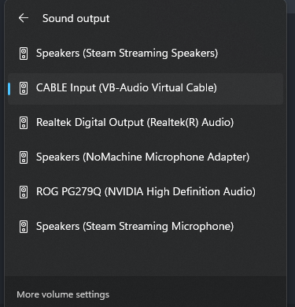

# MoonDeck Buddy 

A server-side part of the [MoonDeck](https://github.com/FrogTheFrog/moondeck) plugin for the SteamDeck.

The main goal is to have reliable information about Steam state:
 * is Steam running or not;
 * what Steam game is running and whether the game we want is updating or not;
   * **note:** Non-Steam games are not supported.

Additionally, it allows to:
 * launch a Steam game;
 * close the Steam process;
 * shutdown, restart or suspend the PC.

## How to install it?

### Windows

#### Step 1 (optional)

Install the latest [redistributables](https://learn.microsoft.com/en-us/cpp/windows/latest-supported-vc-redist) for Windows.

#### Step 2

Go to the [Releases](https://github.com/FrogTheFrog/moondeck-buddy/releases) page and grab the latest release. Either the installer or semi-portable (because it needs redistributables from the previous tep) version will do.

#### Step 3

Verify that the app is running:

#### Step 4 (optional)

Enable autostart by clicking on the icon (right-click) and selecting the following option:

## Linux

You'll need to compile it for now :D, check Github's build workflow for linux.

## Note about autostart

It creates the shortcut in the user's startup directory pointing to the executable. If you move the executable around it will point to the invalid location and you will need to recreate the shortcut by turning the autostart off and on again.

Also if you remove the app without turning it off, you will need to remove it manually.

# Log file location

On Windows the logs are located next to the executable.

On Linux the logs are located in `/tmp`.

# Additional configuration

Everytime the app is started, a configuration file called `settings.json` is read or created. After modifying the file, the app must be restarted for changes to apply.

On Windows the configuration file is located next to the executable.

On Linux the configuration file is located in `$XDG_CONFIG_HOME/moondeckbuddy` or `~/.config/moondeckbuddy`.

## Settings

### Port (default: 59999)

The port to be opened by the app for communication.

### Logging rules (default: "")

Can be used to enable/disable logging for various categories.

By default, Buddy logs information that is of severity **INFO** or above. To enable Buddy's debug logs, set the parameter value to `"buddy.*.debug=true"`.

### Handled displays (default: [])

#### Windows

By default, Buddy will change resolution for display(-s) that is marked as primary.

Here you can override this choice, with a list of display names that you want to change resolution for instead.

#### Linux (X11)

By default, Buddy will change resolution for the **default** screen of the **default** display.

Here you can override the screen choice, with a list of screen names that you want to change resolution for instead.

Note: in the Buddy's configuration the screen is refered to as a display due to different concepts between X11 and Windows. Buddy will always work with the default display from the environment.

#### Linux (Wayland)

Resolution change not supported yet as the [API](https://wayland.app/protocols/wlr-output-management-unstable-v1) is not mature enough and the compositor support is lacking.

#### Finding the display names

You can enable the debug mode to check what displays are available as they are printed when trying to change resolution.

## Sunshine setup

Since the NVidia has discontinued its Gamestream service, the Sunshine has now become the primary target for MoonDeckBuddy.

For this reason another process is distributed alongside the Buddy, called **MoonDeckStream**.

### What is MoonDeckStream?

It's a very simple process where all it does is notifies the Buddy, if it's alive (the stream is active) or not. That's it. It does nothing else...

### How to configure it?

All you have to do is to set the application name to **MoonDeckStream** (no other name) and set the command to the executable, like this:

### No audio on fresh stream

Sunshine can sometimes default to using "Steam Streaming Speakers" as the default virtual sink.

When Steam is started and if the audio device is set to "Steam Streaming Speakers", it resets the audio device to the system's default one (for whatever reason). Simply put, you'll have no audio when you start streaming.

The solution is to use a virtual sink other than "Steam Streaming Speakers" in Sunshine. It can be the same sink as your actual audio device if it is turned off during stream or any other virtual sink. For example, [VB-CABLE Virtual Audio Device](https://vb-audio.com/Cable/) works nicely as a virtual sink for Sunshine.

# Known issues

## Windows

So far everything is working as intended.

## Linux

- Vulkan shader compilation puts the detection algorithm into a limbo state, where it is waiting for the game to start, however the Steam does not report the game as running or updating. Moondeck will timeout after some time saying that the game has failed to start. There is no good solution known at the moment how to detect this that would not give false-positive detection. If this happens to you just start the MoonDeck stream again.
