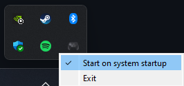
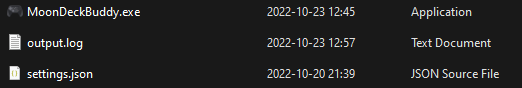
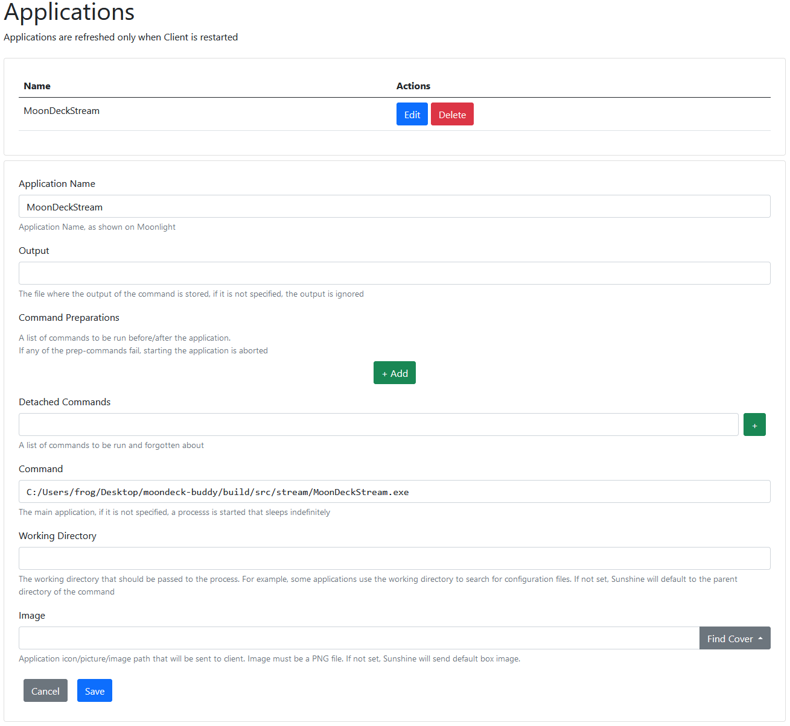

# MoonDeck Buddy 

A server-side part of the [MoonDeck](https://github.com/FrogTheFrog/moondeck) plugin for the SteamDeck.

The main goal is to have reliable information about steam state:
 * is Steam running or not;
 * what Steam game is running and whether the game we want is updating or not;
   * **note:** Non-Steam games are not supported.

Additionally, it allows to:
 * launch a Steam game;
 * close the Steam process;
 * shutdown or restart the PC.

## How to install it?

### Step 1 (optional)

Install the latest [redistributables](https://learn.microsoft.com/en-us/cpp/windows/latest-supported-vc-redist) for Windows.

### Step 2

Go to the [Releases](https://github.com/FrogTheFrog/moondeck-buddy/releases) page and grab the latest release. Either the installer or semi-portable (because it needs redistributables from the previous tep) version will do.

### Step 3

Verify that the app is running:

### Step 4 (optional)

Enable autostart by clicking on the icon (right-click) and selecting the following option:

#### Note

It creates the shortcut in the user's startup directory pointing to the executable. If you move the executable around it will point to the invalid location and you will need to recreate the shortcut by turning the autostart off and on again.

Also if you remove the app without turning it off, you will need to remove it manually.

## Additional configuration

After the first run, the configuration file will be created in the same directory where the executable is located:

After changing any of them, the app needs to be restarted.

#### Port (default: 59999)

The port to be opened by the app for communication.

#### Verbose (default: false)

Enables verbose logging for debugging issues.

## Sunshine setup

Since the NVidia has discontinued its Gamestream service, the Sunshine has now become the primary target for MoonDeckBuddy.

For this reason another process is distributed alongside the Buddy, called **MoonDeckStream**.

### What is MoonDeckStream?

It's a very simple process where all it does is notifies the Buddy, if it's alive (the stream is active) or not. That's it. It does nothing else...

### How to configure it?

All you have to do is to set the application name to **MoonDeckStream** (no other name) and set the command to the executable, like this:

